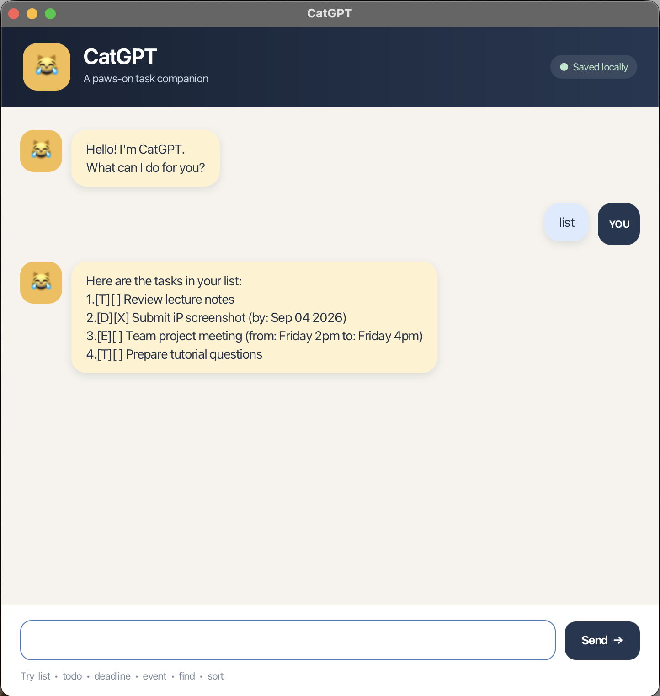

# CatGPT User Guide

CatGPT is a desktop task manager with a chat interface. It keeps todos, deadlines, and events in a
local data file so that they remain available when you reopen the application.



## Quick start

1. Install Java 25.
2. Download `catgpt.jar` from the latest GitHub release.
3. Open a terminal in the folder that contains the JAR file.
4. Run `java -jar catgpt.jar`.
5. Enter a command in the text box and press **Enter** or click **Send**.

Commands are not case-sensitive. Extra spaces before, after, or between command words are ignored.

## Add a todo

Use `todo DESCRIPTION` to add a task without a date or time.

Example: `todo read chapter 3`

```text
Got it. I've added this task:
[T][ ] read chapter 3
Now you have 1 task in the list.
```

## Add a deadline

Use `deadline DESCRIPTION /by yyyy-MM-dd` to add a task with a due date. The date must be valid and
must use the shown year-month-day format.

Example: `deadline submit report /by 2026-09-18`

```text
Got it. I've added this task:
[D][ ] submit report (by: Sep 18 2026)
Now you have 2 tasks in the list.
```

## Add an event

Use `event DESCRIPTION /from START /to END` to add an event. `START` and `END` can contain words,
dates, or times.

Example: `event project meeting /from Monday 2pm /to Monday 3pm`

```text
Got it. I've added this task:
[E][ ] project meeting (from: Monday 2pm to: Monday 3pm)
Now you have 3 tasks in the list.
```

## List tasks

Use `list` to display every task. `[X]` means that a task is complete, while `[ ]` means that it is
incomplete.

Example: `list`

```text
Here are the tasks in your list:
1.[T][ ] read chapter 3
2.[D][ ] submit report (by: Sep 18 2026)
3.[E][ ] project meeting (from: Monday 2pm to: Monday 3pm)
```

## Mark a task

Use `mark NUMBER` to mark a task as complete. Use the number shown by the `list` command.

Example: `mark 1`

```text
Nice! I've marked this task as done:
[T][X] read chapter 3
```

## Unmark a task

Use `unmark NUMBER` to mark a task as incomplete.

Example: `unmark 1`

```text
OK! I've marked this task as not done yet:
[T][ ] read chapter 3
```

## Delete a task

Use `delete NUMBER` to remove a task.

Example: `delete 2`

```text
Noted. I've removed this task:
[D][ ] submit report (by: Sep 18 2026)
Now you have 2 tasks in the list.
```

## Find tasks

Use `find KEYWORD` to display tasks whose descriptions contain the keyword. The search is not
case-sensitive.

Example: `find project`

```text
Here are the matching tasks in your list:
1.[E][ ] project meeting (from: Monday 2pm to: Monday 3pm)
```

## Sort tasks

Use `sort` to arrange tasks alphabetically by description. Letter case does not affect the order.
CatGPT saves the sorted order for future sessions.

Example: `sort`

```text
Here are your tasks sorted alphabetically:
1.[E][ ] project meeting (from: Monday 2pm to: Monday 3pm)
2.[T][ ] read chapter 3
```

## Exit CatGPT

Use `bye` to show the goodbye message and close the application.

Example: `bye`

```text
Bye. Hope to see you again soon!
```

## Command summary

| Action | Command |
|---|---|
| Add a todo | `todo DESCRIPTION` |
| Add a deadline | `deadline DESCRIPTION /by yyyy-MM-dd` |
| Add an event | `event DESCRIPTION /from START /to END` |
| List tasks | `list` |
| Mark a task | `mark NUMBER` |
| Unmark a task | `unmark NUMBER` |
| Delete a task | `delete NUMBER` |
| Find tasks | `find KEYWORD` |
| Sort tasks | `sort` |
| Exit | `bye` |

CatGPT saves changes automatically in `data/catgpt.txt`.
